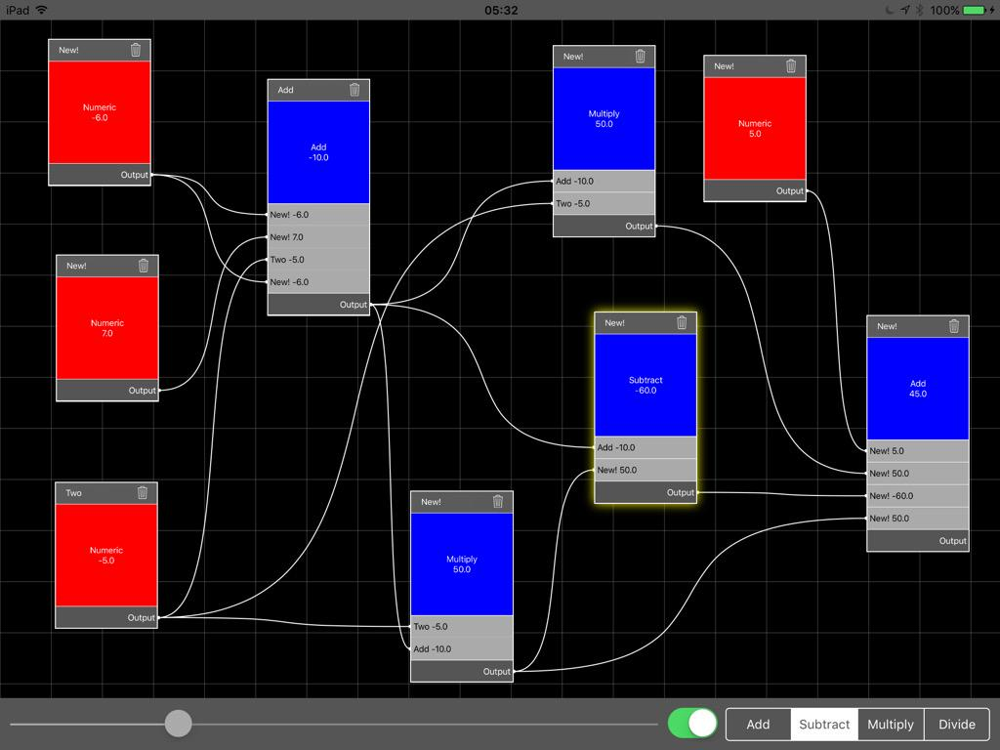

# ShinpuruNodeUI
Node Based UI Component Written in Swift

Companion Project to http://flexmonkey.blogspot.co.uk/2015/09/a-swift-node-based-user-interface.html

With the exciting news about Apple's new iPad Pro and the new Core Image filters in iOS 9 (some powered by Metal Performance Shaders!), now is a perfect time for me to start working on version 3 of my node based image processing application, Nodality. 

I started writing the Swift version of Nodality when I was a little wet behind the ears and, to be frank, to get it working nicely under Swift 2 it could benefit from a total rewrite. The node based user interface part of the code is very tightly coupled with the image filtering logic and would be impossible to reuse for another type of application. 

So, with that in mind, I've rebuilt that code to totally separate the display logic from the image handling and opened it up to accept injectable renderers. This means my node based UI component, ShinpuruNodeUI, can be easily reused in another type of application. For example, it could render database schemas, business process workflows or even audio devices and filters.

This post looks at how you could implement ShinpuruNodeUI in your own app rather than discussing the internals of the component itself. If you have any questions about the actual component, please feel free to comment on this post or reach out to me via Twitter where I am @FlexMonkey.

The project comes bundled with a simple demonstration calculator app which has been my default "getting started" app for node based user interfaces since I first started coding them back in 2008! The calculator code illustrates how you could implement your own business logic in a node based application.

##Interaction Design

The main user gestures are:

* To create a new node, long press on the background
* To toggle a relationship between two nodes
* Long press the source node until the background colour changes to light grey
  * The component is now in "relationship creation mode"
  * Tap an input (light grey row) on a target and the relationship is created (or removed if that relationship exists)
* To remove a node, tap the little trash-can icon in the node toolbar
* The entire canvas can be zoomed and panned 

I've played with a more traditional drag gesture to create relationships, but found this "relationship creation mode" pattern worked well for touch devices. In this release, there's nothing preventing users from creating circular relationships which cause the app to crash -  there's a fix for this pending. 

##Installation

ShinpuruNodeUI is manually installed and requires you to copy the following files into your project:

* `SNNodeWidget` A node widget display component
* `SNNodesContainer` The superview to the node widgets and background grid
* `SNRelationshipCurvesLayer` The CAShapeLayer that renders the relationship curves
* `SNView` The main ShinpuruNodeUI component 
* `ShinpuruNodeDataTypes` Contains supporting classes and protocols: 
  * `SNNode` A node data type
  * `SNDelegate` The delegate protocol 
  * `SNItemRenderer`, `SNOutputRowRenderer`, `SNInputRowRenderer` base classes for renderers that you can extend for your own implementation 

This is bound to change as the component evolves and I'll keep the read-me file updated.

##Instantiating the Component

Set up is pretty simple. Instantiate an instance:

    let shinpuruNodeUI = SNView()

Add it as a subview:

    view.addSubview(shinpuruNodeUI)

...and set its bounds:

    shinpuruNodeUI.frame = CGRect(x: 0,
        y: topLayoutGuide.length,
        width: view.frame.width,

        height: view.frame.height - topLayoutGuide.length)

##An Overview of SNDelegate

For ShinpuruNodeUI to do anything interesting, it needs a nodeDelegate which is of type SNDelegate. The nodeDelegate is responsible for everything from acting as a datasource to providing renderers and includes these methods:

* `dataProviderForView(view: SNView) -> [SNNode]?` returns an array of SNNode instances
* `itemRendererForView(view: SNView, node: SNNode) -> SNItemRenderer` returns the main item renderer for the view. In my demo app, these are the red and blue squares that display the value of the node.
* `inputRowRendererForView(view: SNView, node: SNNode, index: Int) -> SNInputRowRenderer` returns the renderer for the input rows. In my demo app, these are the light grey rows that display the value of an input node.
* `outputRowRendererForView(view: SNView, node: SNNode) -> SNOutputRowRenderer` returns the renderer for the output row. In my demo app, this is the dark grey row at the bottom of the node widget.
* `nodeSelectedInView(view: SNView, node: SNNode?)` this method is invoked when the user selects a node. In my demo app, it's when I update the controls in the bottom toolbar.
* `nodeMovedInView(view: SNView, node: SNNode)` this method is invoked when a node is moved. This may be an opportunity to save state.
* `nodeCreatedInView(view: SNView, position: CGPoint)` this method is invoked when the user long-presses on the background to create a new node. ShinpuruNodeUI isn't responsible for updating the nodes data provider, so this is an opportunity to add a new node to your array.
* `nodeDeletedInView(view: SNView, node: SNNode)` this method is invoked when the user clicks the trash-can icon. Again, because ShinpuruNodeUI is purely responsible for presentation, this is the time to remove that node from your model and recalculate other node values as required. 
* `relationshipToggledInView(view: SNView, sourceNode: SNNode, targetNode: SNNode, targetNodeInputIndex: Int)` this method is invoked when the user toggles a relationship between two views and, much like deleting a node, you'll need to recalculate the values of affected nodes.
* `defaultNodeSize(view: SNView) -> CGSize` returns the size of a newly created node widget to ensure new node widgets are nicely positioned under the user's finger (or maybe Apple Pencil!)
* `nodesAreRelationshipCandidates(sourceNode: SNNode, targetNode: SNNode, targetIndex: Int) -> Bool` returns a Boolean indicating whether a given source node is a suitable candidate to act as an input to a target node at a specified index.

In my demo app, its the view controller that acts as the nodeDelegate.

So, although ShinpuruNodeUI renders your nodes and their relationships and reports back user gestures, there's still a fair amount that the host application is responsible for. Luckily, my demo app includes basic implementations of everything required to get you up and running.

##Renderers

Node widgets requires three different types of renderers, defined by the SNDelegate above. My demo project includes basic implementations of all three in the DemoRenderers file. 

The three renderers should sub class SNItemRenderer, SNOutputRowRenderer, SNInputRowRenderer and, at the very least,  implement a reload() method and override intrinsicContentSize(). reload() is invoked when ShinpuruNodeUI needs the renderer to update itself (in the case of the demo app, this is generally just updating the text property of a label.

##Implementing a Calculator Application 

My demo calculator app contains a single struct, DemoModel, which manages the logic for updating its nodes when values or inter-node relationships are changed. The view controller mediates between an instance of DemoModel and an instance of ShinpuruNodeUI. 

When a numeric (red) node is selected and its value changed by the slider in the bottom toolbar, the view controller's sliderChangeHandler() is invoked. This method double checks that ShinpuruNodeUI has a selected node, updates that node's value and then calls the DemoModel's updateDescendantNodes() method. updateDescendantNodes() returns an array of all the nodes affected by this update which are then passed back to ShinpuruNodeUI to update the user interface:

    func sliderChangeHandler()
    {
        if let selectedNode = shinpuruNodeUI.selectedNode?.demoNode where selectedNode.type == .Numeric
        {
            selectedNode.value = DemoNodeValue.Number(round(slider.value))
            
            demoModel.updateDescendantNodes(selectedNode).forEach{ shinpuruNodeUI.reloadNode($0) }
        }

    }

Similarly, when a blue operator node (i.e. add, subtract, multiply or divide) is selected and the operator is changed, the selected node's type is changed and updateDescendantNodes() is executed followed by reloading the affected nodes:

    func operatorsControlChangeHandler()
    {
        if let selectedNode = shinpuruNodeUI.selectedNode?.demoNode where selectedNode.type.isOperator
        {
            selectedNode.type = DemoNodeType.operators[operatorsControl.selectedSegmentIndex]
            
            demoModel.updateDescendantNodes(selectedNode).forEach{ shinpuruNodeUI.reloadNode($0) }
        }

    }

ShinpuruNodeUI can invoke delegate methods that will require DemoModel to update its nodes - specifically, deleting a node or changing a relationship. To that end, both DemoModel's deleteNode() and relationshipToggledInView() return an array of affected nodes which are passed back to ShinpuruNodeUI:

    func nodeDeletedInView(view: SNView, node: SNNode)
    {
        if let node = node as? DemoNode
        {
            demoModel.deleteNode(node).forEach{ view.reloadNode($0) }
            
            view.renderRelationships()
        }
    }
    
    func relationshipToggledInView(view: SNView, sourceNode: SNNode, targetNode: SNNode, targetNodeInputIndex: Int)
    {
        if let targetNode = targetNode as? DemoNode,
            sourceNode = sourceNode as? DemoNode
        {
            demoModel.toggleRelationship(sourceNode, targetNode: targetNode, targetIndex: targetNodeInputIndex).forEach{ view.reloadNode($0) }
        }

    }

## Conclusion

ShinpuruNodeUI is still evolving, but is in a state where it can provide the basis for an iOS node based application for a wide variety of use cases. It offers a clear separation of concerns between the presentation of the node relationships, the presentation of the actual data and the computation. 

The complete project is available at my GitHub repository here. Keep an eye out on my blog or on Twitter for an updates!
